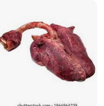
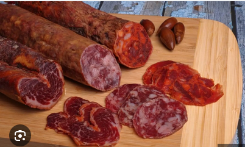
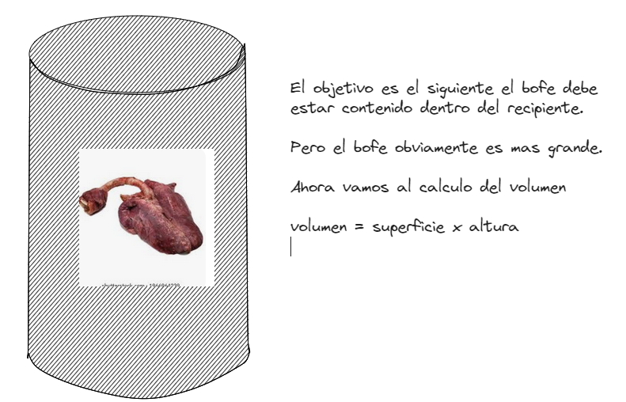
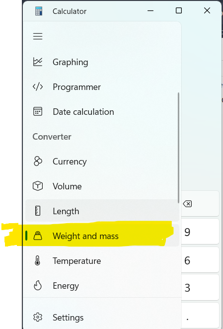
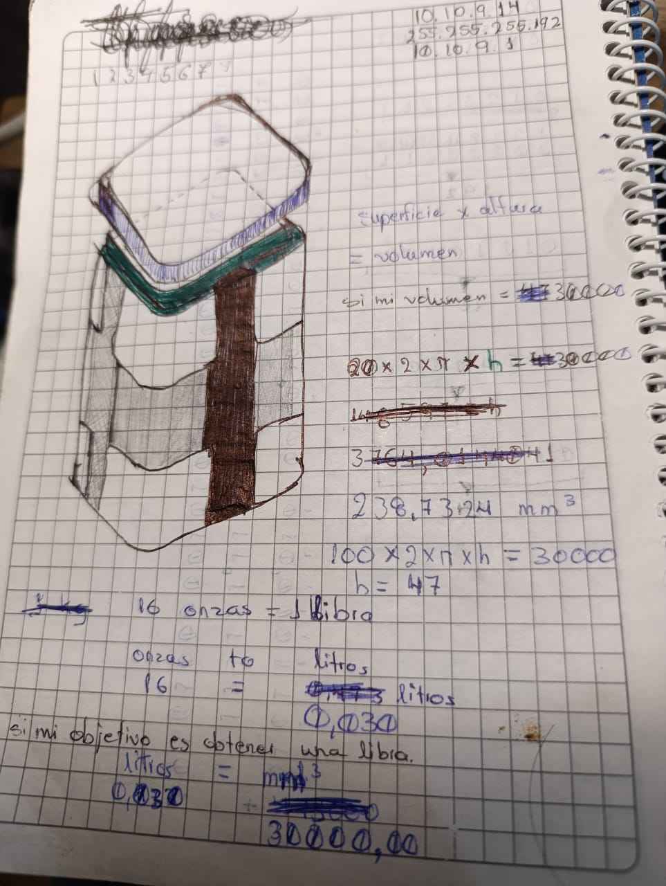

# prj-openscad

En esta rama busco crear un contenedor para los bofes(el pulmon de la vaca) que se pueda adaptar segun las libras que se desee que contenga

# EL BOSQUEJO

Primero debo hablar del bosquejo y como fue naciendo, un dia cualquiera estaba pensando sobre un contenedor de bofe plastico ya que siempre hasta ahora el bofe se almacena en funda, pero esas fundas no son las adecuadas si lo que se desea es obtener una medida exacta en donde no tengas que sacrificarte tanto organizando dichas fundas, ya que al momento para organizar esto se desperdicia mucho, entonces lo que se busca es optimizar la venta de esto.

volumen = superficie x altura

Esta formula anterior la dedusco porque lo que necesita el bofe es convertirse en un embutido

Mira por ejemplo la siguiente imagen de un embutido

Algo asi es a lo que quiero llegar con el bofe, ya que seria mucho mas facil vender esto y mantenerlo congelado para el consumo humano, para el caldo de los gatos y mas cosas.

Ahora bien vamos a ver que pasa si queremos 

Normalmente el bofe se vende en libras, ahora bien el reto es conseguir una formula que me permita calcular las dimensiones del envase en funcion de las libras que deba de contener, debo decir que habria que calcular un margen adicional de espacio ya que los pulmones no son expresamente un liquido como el agua que ocupa todo el espacio posible sino que habra cierto espacio que ocupe el aire circundante, pero la idea es mostrar como podria calcularse las dimensiones del envase y que se adapte segun las libras planteadas, pero bueno por ahora nos centraremos en la idea basica libras y valores especificos luego seremos mas precisos.

Una libra es una unidad de medida peso y masa, habrá que pensar en una forma de convertir peso en volumen.

Hice estos calculos pero creo que estan terriblemente mal, mas sin embargo muestro lo que estaba pensando 

f
